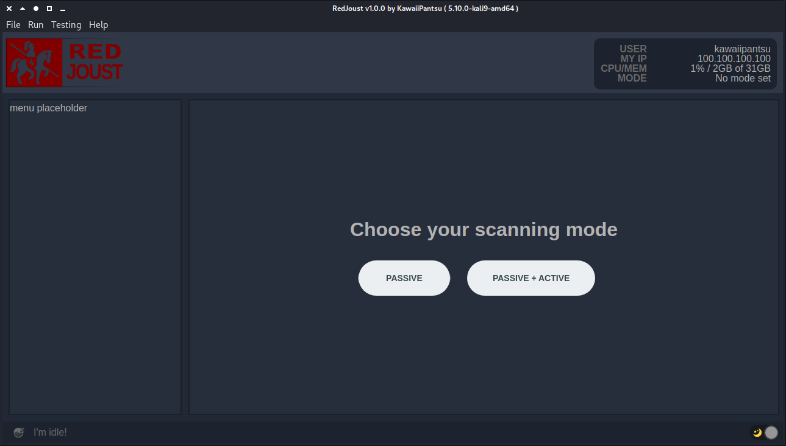

# ᵔᴥᵔ RedJoust

     
> A quick and easy to use security reconnaissance webapp tool, does OSINT, analysis and red-teaming in both passive and active mode. Written in nodeJS and Electron.

---

> Heavily under development
>
> Come back later :)

## What it looks like (what i'm going for)

This is still just a boilerplate on what layout i'm trying to go for, this might change in the near future i have no idea. But so far this is what it's going to look like. Also not functionality at all and placeholders.

More to come soon ! I hope :)

## Status on whats done

- Boiler plate layout done (How i want the app to look)
- Support for Light / Dark OS theme
- Styled scrollbar (Not using OS dependent functionality)
  - Now working for menu sidebar and main window on overflow
- User and system information
- Fetching remote/public IP
- Making sure its at least a bit secure
  - webSecurity on
  - devTools disabled (not doing development)
  - nodeIntegration enabled
  - contextIsolation enabled
  - Privacy mode (enable shading the window for privacy)
- Privacy/lock screen mode
- Menu/File bar with shortcuts and icons
- About window
- Links to github, wiki (help) and issues
- Make logic to set "mode" ie. passive or active
- Figure out how i want my "modules" logic
- Make "mode" logic, modules should follow this
- Make modules to handle recon/analysis/red-team functions (dropped)
- Deciding on storage/settings node module
- Initiating default settings/config
- Reading config settings
- Getting "theme" from config settings, only dark/light/system supported
- Storing config states from session to session (like mode/target)
- Honing in how i want to run items/collecting data
- Functional statusbar (text/icon)
- Statusbar keeps track on running items
- Silly idle quotes in statusbar (for play and show)
- Added debug toggle in config settings (etc hiding all console.log)
- New Preferences window (To etc change config settings values)
- showpage func to provide easy page logic with not found also
- Item click logic, able to do different things depending on state (ready, working, done)
- Simple spin animation on some of the statusbar icon presets (looks fun)
- Cleaned up renderer.js to keep it minimal and everything in preload stage
- New "is done" logic, and tried to comment on how to make "items" for this
- 3 new menu sections, target ip, target hostname, target domain name will show on target selection
- Reset functionallity to whipe slate clean so you can rerun jobs
- Utilizing html data attributes to store item settings for easy implementation
- Showing the config settings in preference window but just for show
- New defaults scheme, no need for cutom defualtsettings writer function
- Next page (goto next) continue logic, will itterate though mode, target and run if they are not set
- Make default first page show easy 3 button layout - Set mode, set target, run
- Default page done
- Added target history, save last 50 targets for future options like autocomplete
- Target history cleanup logic
- Default item page layout/template
- Add "safety" features as, toggle alerting if red-team mode is active
- Make logic to set your target (ip, hostname or domain)
  - setTarget()
    - Show/hide the propper menu sections
    - Should be able to be run onload as well
    - update global vars
    - update conf settings storage
- Target page, history autocomplete

## TODO list (what i want to get done short term)

- Way to find childs/processes of async things running
- Make Preferences window useful
- Preparing for more config settings
  - default NS server to use (static or system)
  - proxy usage
  - tor usage
  - specific item options
- proxy/tor/socks logic
- Getting PowerMonitor to work, so i can attach to System OS idle/suspend events
- Make logic to set your target (ip, hostname or domain)
  - setTarget()
    - Needs to parse/detect if its hostname or ip
    - Enable to find domain name from hostname
    - if ip generate ip subnet info
    - Read from pagetarget
- Make simple DNS lookup module ~~(json return)~~ to test output for page
