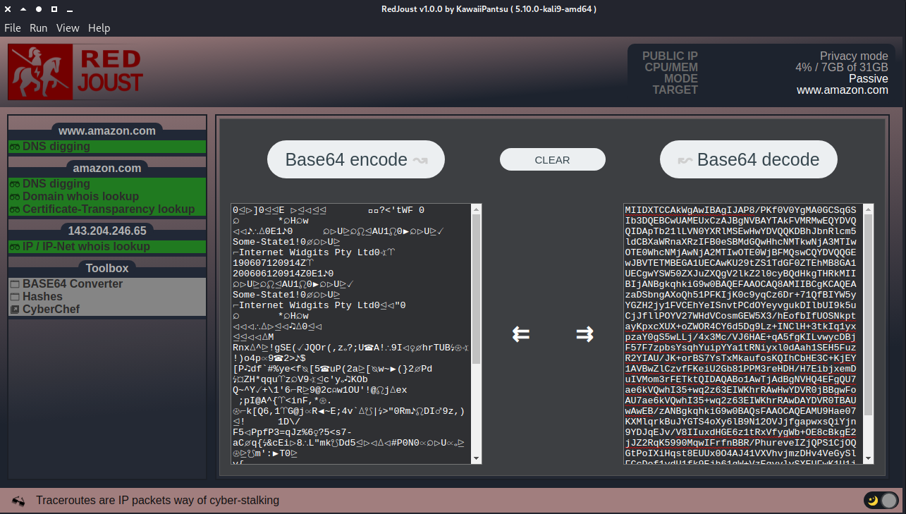

# ᵔᴥᵔ RedJoust

     
> A quick and easy to use security reconnaissance webapp tool, does OSINT, analysis and red-teaming in both passive and active mode. Written in nodeJS and Electron.

---

> Its beginning to take shape !! I now have almost all internal logic in place, so i can now begin to develop a bit more on the actual intel gathering items.
>
> Come back later :)

## What it looks like (what i'm going for)

I have included 2 screenshots, i will update them regularly :)

- First is just the main webapp default page where you can see i have set TARGEt and MODE and then relevent gather info items are shown and also target is parses and split out into other menu sections with each their own relevent gather info items!
- Second is just other cases i wanted to show off, this is etc the Toolbox view of Base64

## Status on whats done

- Boiler plate layout done (How i want the app to look)
- Support for Light / Dark OS theme
- Styled scrollbar (Not using OS dependent functionality)
  - Now working for menu sidebar and main window on overflow
- User and system information
- Fetching remote/public IP
- Making sure its at least a bit secure
  - webSecurity on
  - devTools disabled (not doing development)
  - nodeIntegration enabled
  - contextIsolation enabled
  - Privacy mode (enable shading the window for privacy)
- Privacy/lock screen mode
- Menu/File bar with shortcuts and icons
- About window
- Links to github, wiki (help) and issues
- Make logic to set "mode" ie. passive or active
- Figure out how i want my "modules" logic
- Make "mode" logic, modules should follow this
- Make modules to handle recon/analysis/red-team functions (dropped)
- Deciding on storage/settings node module
- Initiating default settings/config
- Reading config settings
- Getting "theme" from config settings, only dark/light/system supported
- Storing config states from session to session (like mode/target)
- Honing in how i want to run items/collecting data
- Functional statusbar (text/icon)
- Statusbar keeps track on running items
- Silly idle quotes in statusbar (for play and show)
- Added debug toggle in config settings (etc hiding all console.log)
- New Preferences window (To etc change config settings values)
- showpage func to provide easy page logic with not found also
- Item click logic, able to do different things depending on state (ready, working, done)
- Simple spin animation on some of the statusbar icon presets (looks fun)
- Cleaned up renderer.js to keep it minimal and everything in preload stage
- New "is done" logic, and tried to comment on how to make "items" for this
- 3 new menu sections, target ip, target hostname, target domain name will show on target selection
- Reset functionallity to whipe slate clean so you can rerun jobs
- Utilizing html data attributes to store item settings for easy implementation
- Showing the config settings in preference window but just for show
- New defaults scheme, no need for cutom defualtsettings writer function
- Next page (goto next) continue logic, will itterate though mode, target and run if they are not set
- Make default first page show easy 3 button layout - Set mode, set target, run
- Default page done
- Added target history, save last 50 targets for future options like autocomplete
- Target history cleanup logic
- Default item page layout/template
- Add "safety" features as, toggle alerting if red-team mode is active
- Make logic to set your target (ip, hostname or domain)
  - setTarget()
    - Show/hide the propper menu sections
    - Should be able to be run onload as well
    - update global vars
    - update conf settings storage
    - Needs to parse/detect if its hostname or ip
    - Enable to find domain name from hostname
    - if ip generate ip subnet info
    - Read from pagetarget
- Target page, history autocomplete
- Added toggle for external tools menu
- Added toggle for streamer-mode (just removes obvious things like public ip)
- Preparing for more config settings
  - default NS server to use (static or system)
- Target logic done
- updateItem visibility logic done
- updateItem states logic done
- Now able to set target via "enter" or "continue" on target page
- Custom DNS NS server for resolver supported
  - Supports system (use system default ns servers)
  - Multiple custom via array
  - Single custom via string
- Make simple DNS lookup module ~~(json return)~~ to test output for page
- Complete toolbox tool: Base64 convertion
- Complete toolbox tool: Hashes (Live hashing)
- External URL link in toolbox logic (Used for CyberChef etc)
- Toolbox can be toggled show/hide via View menu
- WHOIS function done, using proper sockets and talk to whois query services (OS independent)
- Domain name WHOIS item done
- IP address WHOIS item done
- IP address WHOIS now supports own specific whois server based on ip-net
- Fixed FQDN bug where etc www.amazon.co.uk would think the domain was co.uk :) (classic!)
- Up to date whois server list in json format (updated via a php script by me so semi auto)

## TODO list (what i want to get done short term)

- Way to find childs/processes of async things running
- Make Preferences window useful
- Preparing for more config settings
  - proxy usage
  - tor usage
  - specific item options
- proxy/tor/socks logic
- Getting PowerMonitor to work, so i can attach to System OS idle/suspend events
