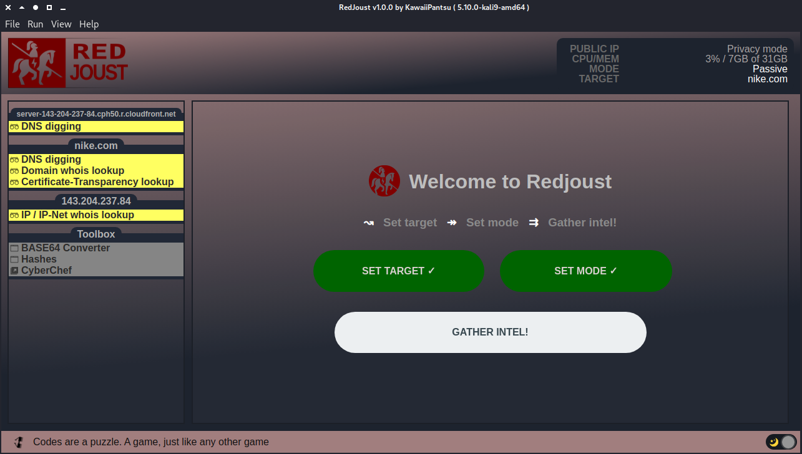

# ᵔᴥᵔ RedJoust

     
> A quick and easy to use security reconnaissance webapp tool, does OSINT, analysis and red-teaming in both passive and active mode. Written in nodeJS and Electron.

---

> Heavily under development
>
> Come back later :)

## Status on whats done

- Boiler plate layout done (How i want the app to look)
- Support for Light / Dark OS theme
- Styled scrollbar (Not using OS dependent functionality)
  - Now working for menu sidebar and main window on overflow 
- User and system information
- Fetching remote/public IP
- Making sure its at least a bit secure
  - webSecurity on
  - devTools disabled (not doing development)
  - nodeIntegration enabled
  - contextIsolation enabled
  - Privacy mode (enable shading the window for privacy)
- Privacy/lock screen mode
- Menu/File bar with shortcuts and icons
- About window
- Links to github, wiki (help) and issues

## TODO list (what i want to get done short term)

- Make logic to set "mode" ie. passive or active
- Make logic to set your target (ip, hostname or domain)
- Make "main view" front page when no target is set (to allow setting target and mode)
- Make "main view" front page to show a bit of target info (when target is set show this)
- Figure out how i want my "modules" logic
- Make simple DNS lookup module (json return) to test data
- Make "mode" logic, modules should follow this
- Make modules to handle recon/analysis/red-team functions

## What it looks like (what i'm going for)

This is still just a boilerplate on what layout i'm trying to go for, this might change in the near future i have no idea. But so far this is what it's going to look like. Also not functionality at all and placeholders. Only thing really working is the small user/sys info box top right and the toggle switch bottom right for dark/light theme.

More to come soon ! I hope :)

